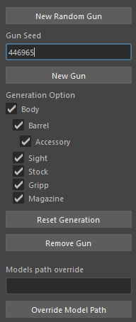

<!-- Ce fichier markdown contient une image et est donc plus claire a lire dans un editeur ou viewer markdown comme VSCode mais ce n'est pas nécéssaire-->

# Projet de _gun_ généré aléatoirement

---

## Idée de base

L'idée de base était de créer un générateur de guns aléatoire utilisant des assets modulaires. L'outil est largement inspiré du système des jeux _Borderland_.

## Fonctionnement

L'outil ce basse sur le model suivant :

1. Un gun est composé de 7 catégories de pièces :

   1. Le corp : _Body_

   2. Le viseur : _Sight_

   3. La crosse : _Stock_

   4. La poignée : _Gripp_

   5. L'accessoire : _Accessory_

   6. Le magazine : _Magazine_

   7. Le canon : _Barrel_

2. Hormis l'accessoire qui est accroché au canon, toute les pièces sont accrochées au corp.

3. Chaque pièce est stockée dans un fichier maya lui même dans un dossier de la catégorie.

4. L'outil choisie une pièce dans chaque catégorie grâce à une _seed_ soit aléatoire soit fournie par l'utilisateur.

## Installation

Le script et ses ressources sont stockée dans le dossier `procedural_guns`.

Le script doit être placé par défaut dans dossier `User/Document/Maya/2022/script/`.

Dans le cas où le script n'est pas installé dans le bon dossier alors l'utilisateur dois changer le chemin avec l'interface pour mettre le chemin complet du dossier `procedural_guns/ressources/models` sans quoi les modèles n'apparaitrons pas.

## Utilisation

#### L'interface est en 3 parties :

1. La génération.

   1. Un bouton pour générer un gun aléatoirement.

   2. Une zone de texte pour entrer une _seed_ personnalisée.

   3. Un bouton pour générer le gun avec la _seed_ choisie ou la dernière utilisée (permet de regénérer le _gun_ avec d'autres options de personnalisations)

2. Les options de génération.

   1. Une liste de _checkboxes_ en disposition en arbre qui permet de choisir quel type de pièces seront générées.
   2. Un bouton qui recoche toute les _checkboxes_.
   3. Un bouton permettant de supprimer le _gun_ de la scène.

3. _L'override_ du chemin des modèles.

   1. Une zone de texte pour changer le chemin des modèles 3D.

   2. Un bouton pour valider le nouveau chemin.

#### L'utilisation des modèles :

Les modèles étant stockés dans des dossiers au nom des catégories de pièces, il suffit d'ajouter des fichiers de modèles dans les dossiers correspondant en respectant les noms et l'utilisation des objets balises dans les fichiers pour pouvoir augmenter le nombre de modules que le script peut utiliser.
